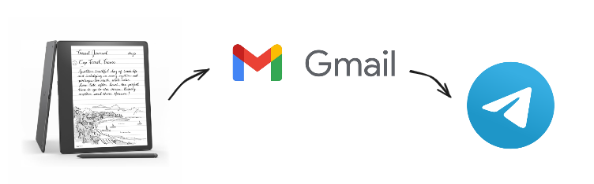

# Kindle Notes Saver

An easy way to save Kindle notes. Just send a message to your email address, and this bot will forward it to you in Telegram.   



# Getting Started

### Mail preparation: 
1. Create a rule for emails with notes, mark them with a label. Bot will search emails by this label. 
2. Get the [app password](https://support.google.com/mail/answer/185833?sjid=3026716704556067083-EU) for your email account.
### Telegram preparation:
1. Create a bot in Telegram using [BotFather](https://t.me/BotFather) and get an API token. 
1. Find out your Telegram ID by writing to [this bot](https://t.me/userinfobot) in Telegram.
### Bot preparation:
1. Clone this repo and install dependencies:
```bash
pip install -r requirements.txt
```
2. In the `kns.py` set your own values:
```python
# Email settings
IMAP_SERVER = "imap.gmail.com"
EMAIL_ACCOUNT = ""
EMAIL_PASSWORD = "" 
LABEL_NAME = ""
# Telegram settings
BOT_TOKEN = ""
TELEGRAM_ID = ""
INTERVAL_IN_MINUTES = 15
```
3. Run program:
```bash 
python kns.py
```

# How To Use It

1. Send a note to your email.
2. Wait until the bot checks the mail according to the schedule (the period is set in `INTERVAL_IN_MINUTES`), or trigger it manually by send `/update` command to the bot
3. Get a `.pdf` file in Telegram
4. ???
5. PROFIT


# Limitations
- Individual file size should be less than 50 MB (before compression in a ZIP file).
- Telegram does not ensure consistency of file names
- Need Zotero integration